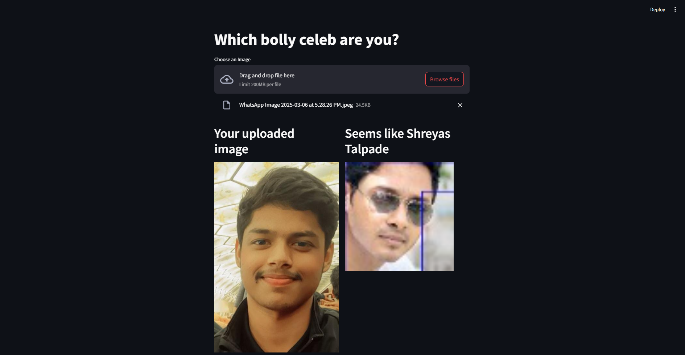

# Bollywood Celebrity Predictor

This project is a **Bollywood Celebrity Predictor** that uses deep learning and computer vision to identify which Bollywood celebrity a given image resembles. It leverages pre-trained models for face detection and feature extraction to compare user-uploaded images with a database of celebrity images.

---

## Features

- **Face Detection**: Detects faces in uploaded images using the MTCNN model.
- **Feature Extraction**: Extracts facial features using the pre-trained `VGGFace` model (ResNet50 variant).
- **Similarity Matching**: Compares extracted features with a precomputed database of Bollywood celebrity features using cosine similarity.
- **Web Interface**: Provides a user-friendly interface built with Streamlit for uploading images and viewing predictions.

---

## Project Structure
Bolly-celeb-predictor/ │ ├── app.py # Main application script for Streamlit ├── feature_extractor.py # Script to extract and save celebrity image features ├── test.py # Script to test feature extraction and similarity matching ├── embedding.pkl # Precomputed feature vectors for celebrity images ├── filenames.pkl # List of file paths for celebrity images ├── requirement # List of Python dependencies ├── data/ # Directory containing celebrity images (organized by folders) ├── uploads/ # Directory for storing user-uploaded images ├── sample/ # Directory for storing sample test images ├── .idea/ # PyCharm project configuration files └── .myenv/ # Virtual environment directory

---

## Installation

1. Clone the repository:
   ```bash
   git clone https://github.com/your-username/Bolly-celeb-predictor.git
   cd Bolly-celeb-predictor
   ```

2. Create and activate a virtual environment:
   ```bash
   python -m venv .myenv
   source .myenv/bin/activate  # On Windows: .myenv\Scripts\activate
   ```

3. Install the required dependencies:
   ```bash
   pip install -r requirement
   ```

4. Download or prepare the data/ directory with Bollywood celebrity images. Organize the images into subdirectories named after the celebrities (e.g., data/Aamir_Khan/).

5. Extract features from celebrity images:
   ```bash
   python feature_extractor.py
   ```

## Usage

6. Run the Streamlit app:
   ```bash
   streamlit run app.py
   ```

7. Test feature extraction and similarity matching:
   ```bash
   python test.py
   ```

## How It Works
1. Feature Extraction:
The feature_extractor.py script processes all celebrity images in the data/ directory.
It extracts feature vectors using the VGGFace model and saves them in embedding.pkl.

2. Prediction:
The app.py script allows users to upload an image.
It detects the face in the uploaded image, extracts its features, and compares them with the precomputed celebrity features.
The closest match is displayed along with the celebrity's name and image.

3. Testing:
The test.py script demonstrates the feature extraction and similarity matching process using a sample image.

## Dependencies
The project requires the following Python libraries:
mtcnn==0.1.0
tensorflow==2.3.1
keras==2.4.3
keras-vggface==0.6
keras_applications==1.0.8
streamlit
Pillow
opencv-python
numpy
scikit-learn
tqdm

## Example
1.Upload an image of yourself or someone else.
2.The application will detect the face, extract its features, and compare them with the celebrity database.
3.The predicted Bollywood celebrity will be displayed along with their image.

## Example Output

Below is an example of the application output:



I guess which is not correct tho :( 

## Future Improvements
Add support for multiple faces in a single image.
Improve accuracy by fine-tuning the VGGFace model on Bollywood celebrity data.
Add a feedback mechanism to improve predictions over time.
Enhance the UI for better user experience.

## License

This project is licensed under the MIT License. See the [LICENSE](LICENSE) file for details.

## Acknowledgments

- [VGGFace](https://github.com/rcmalli/keras-vggface) for the pre-trained face recognition model.
- [MTCNN](https://github.com/ipazc/mtcnn) for face detection.
- [Streamlit](https://streamlit.io/) for the web interface.

Feel free to contribute to this project by submitting issues or pull requests!